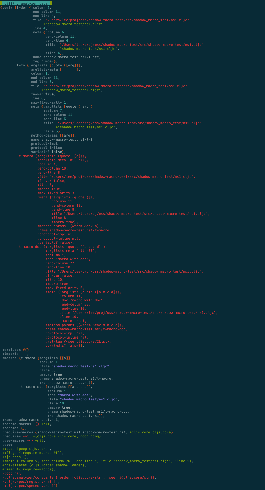

# repro-shadow-cljs-analyzer-macro-diff

## Compiler environment macro differences
There are differences in the analyzer compiler env maps when compiling under 
ClojureScript vs when compiling under Shadow CLJS. 

I noticed this when trying to compile a project with Shadow CLJS that uses 
[rewrite-cljc](https://github.com/lread/rewrite-cljc-playground) 
which includes an internal cljs version of potemkin import-vars.

ClojureScript analysis includes macros under `:defs` and `:macros` whereas Shadow
CLJS only includes macros under `:macros`.

This little project demonstrates this difference.

To repoduce, run `./script/test.sh`, which:

1. dumps cljs analyzer's view of `shadow-macro-test.ns1` when compiling under ClojureScript
2. dumps same when compiling under Shadow CLJS
3. diffs the edn of above

I originally had this script running on CircleCI to show the diff result, but it misled due to 
improper ANSI color treatment. Here's a screenshot instead:



## Resolve macro differences

In a chat on Slack with the very kind thheller, he hinted that a cljs import-vars should not be 
importing macros. So I studied my old cljs import-vars code and saw that indeed it intended to 
skip macros - but it was not doing so for Shadow CLJS.

So I updated this little app to also dump the output of a call to `cljs.analyzer.api/resolve` for a macro.

Results for ClojureScript:

Clojure
```
{:protocol-inline nil,
 :meta {:file "/Users/lee/proj/oss/repro-shadow-cljs-analyzer-macro-diff/src/shadow_macro_test/ns1.cljc",
        :line 8,
        :column 11,
        :end-line 8,
        :end-column 18,
        :macro true,
        :arglists (quote ([a]))},
 :ns shadow-macro-test.ns1,
 :name shadow-macro-test.ns1/t-macro,
 :file "/Users/lee/proj/oss/repro-shadow-cljs-analyzer-macro-diff/src/shadow_macro_test/ns1.cljc",
 :end-column 18,
 :method-params ([&form &env a]),
 :protocol-impl nil,
 :op :var,
 :arglists-meta (nil nil),
 :column 1,
 :variadic? false,
 :line 8,
 :macro true,
 :end-line 8,
 :max-fixed-arity 3,
 :fn-var false,
 :arglists (quote ([a]))}
```

Versus results for Shadow CLJS:

Clojure
```
{:arglists ([a]),
 :line 8,
 :column 1,
 :file "shadow_macro_test/ns1.cljc",
 :name shadow-macro-test.ns1/t-macro,
 :ns shadow-macro-test.ns1,
 :macro true}
```

The CloureScript version has some duplicated data, notably for me, `:macro` is both under root and `:meta`. 

The Shadow CLJS version does not include `:meta`. 

## Resolution
I needed to adapt my code to the variation returned from `cljs.analyzer.api/resolve` under Shadow CLJS.
